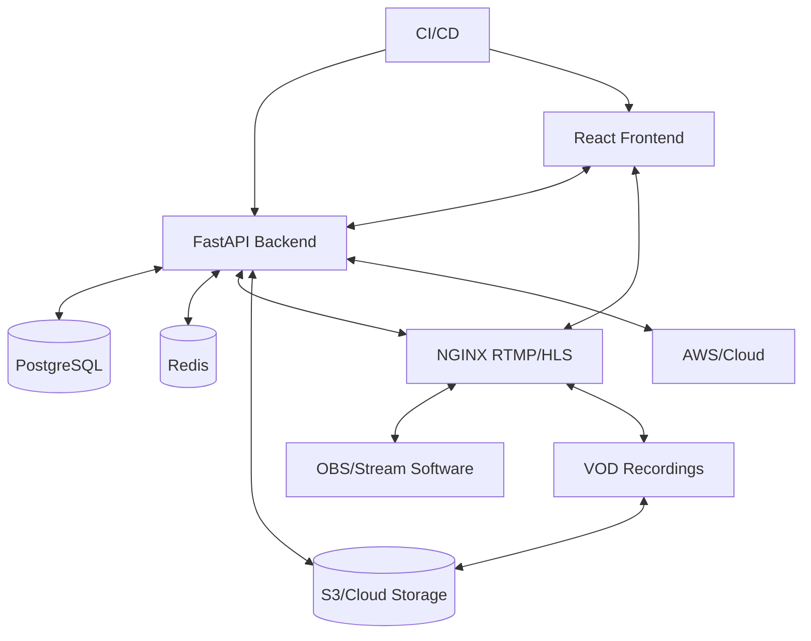

# VLS: Enterprise Video Live Streaming Platform

[](https://github.com/sefineh-ai/VLS/actions)
[](LICENSE)
[](infra/docker-compose.yml)

---

## Executive Summary
**VLS** is an enterprise-grade, cloud-ready platform for live and on-demand video streaming. Built for scalability, security, and extensibility, it powers real-time video, chat, and VOD for organizations, events, and communities.

- **For:** Enterprises, media companies, education, events, SaaS
- **Why:** Own your streaming stack, control your data, scale globally
- **What:** Secure, robust, and feature-rich live streaming with moderation, analytics, and cloud integration

---

## Architecture



---

## Features
- **Authentication & Security:** JWT, refresh tokens, RBAC, account lockout, audit logging, password policy
- **Live Streaming:** RTMP ingest, HLS playback, stream key management, webhooks
- **VOD:** Automated recording, playback, S3/cloud-ready
- **Real-Time Chat:** Persistent, moderated, WebSocket-based
- **Moderation:** Ban/mute, message deletion, admin tools
- **Analytics:** (Planned) View count, duration, engagement
- **DevOps:** Docker Compose, CI/CD, AWS-ready

---

## Quick Start

```bash
git clone https://github.com/sefineh-ai/VLS.git
cd VLS
# Backend
cd backend
python3 -m venv ~/.venv
source ~/.venv/bin/activate
pip install -r requirements.txt
cp .env.example .env
~/.venv/bin/alembic upgrade head
uvicorn app.main:app --reload
# Infra (NGINX RTMP, Redis)
cd ../infra
docker-compose up
```

---

## API Example

**Get Stream Ingest URL:**
```http
GET /streams/{stream_id}/ingest-url
Authorization: Bearer <token>
```
**WebSocket Chat:**
```ws
ws://localhost:8000/ws/streams/{stream_id}/chat
```
**VOD Playback:**
```http
GET /vods/{vod_id}/playback-url
```

---

## Security & Compliance
- **Password policy:** Enforced (min length, complexity)
- **Account lockout:** After repeated failed logins
- **Audit logging:** All auth events
- **RBAC:** Role-based access for all endpoints
- **GDPR-ready:** Data deletion, audit, and privacy controls

---

## Deployment
- **Local:** Docker Compose for NGINX RTMP, Redis
- **Cloud:** AWS ECS/EKS, RDS, S3, IVS (configurable)
- **CI/CD:** GitHub Actions (see `.github/workflows/`)
- **.env:** All secrets/configs via environment variables

---

## Project Structure
```text
VLS/
├── backend/      # FastAPI, PostgreSQL, Redis
├── frontend/     # React (to be implemented)
├── infra/        # Docker Compose, NGINX RTMP config
└── README.md
```

---

## Contact & Support
- **Lead:** Sefineh (GitHub: [sefineh-ai](https://github.com/sefineh-ai))
- **Issues:** [GitHub Issues](https://github.com/sefineh-ai/VLS/issues)
- **Contributing:** PRs welcome! See [CONTRIBUTING.md] (to be created)

---

## License
MIT
