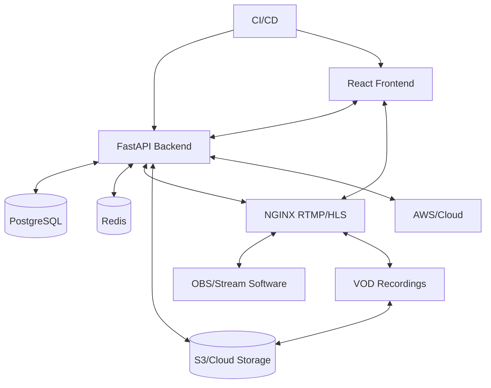

# VLS: Enterprise Video Live Streaming Platform

[](https://github.com/sefineh-ai/VLS/actions)
[](LICENSE)
[](infra/docker-compose.yml)

---

## Executive Summary
**VLS** is a next-generation, enterprise-grade platform for live and on-demand video streaming. Designed for scalability, security, and extensibility, VLS empowers organizations to deliver real-time video, interactive chat, and VOD experiences at global scale.

- **Target Users:** Enterprises, media companies, education, events, SaaS, and community platforms
- **Business Value:** Own your streaming infrastructure, ensure data sovereignty, and scale with confidence
- **Key Capabilities:** Secure, robust, and feature-rich live streaming with advanced moderation, analytics, and seamless cloud integration

---

## Why VLS?
- **Enterprise-Ready:** Modular, cloud-native architecture for rapid deployment and scaling
- **Security First:** End-to-end authentication, RBAC, audit logging, and compliance controls
- **Extensible:** Easily integrate with third-party services, analytics, and custom workflows
- **Cloud & On-Prem:** Deploy on AWS, private cloud, or hybrid environments
- **Open Source:** Transparent, auditable, and community-driven

---

## Architecture Overview



---

## Technology Stack
- **Frontend:** React, Vite, Tailwind CSS
- **Backend:** FastAPI, SQLAlchemy, Alembic, PostgreSQL, Redis
- **Streaming:** NGINX RTMP, HLS, OBS integration
- **DevOps:** Docker Compose, GitHub Actions, AWS-ready

---

## Core Features
- **Authentication & Security:** JWT, refresh tokens, RBAC, account lockout, audit logging, password policy
- **Live Streaming:** RTMP ingest, HLS playback, unique stream keys, webhooks
- **VOD:** Automated recording, playback, S3/cloud-ready
- **Real-Time Chat:** Persistent, moderated, WebSocket-based
- **Moderation:** Ban/mute, message deletion, admin tools
- **Analytics:** (Planned) View count, duration, engagement
- **Compliance:** GDPR-ready, audit trails, data privacy controls
- **Extensibility:** Modular services, API-first, easy to integrate with external tools
- **DevOps:** Docker Compose, CI/CD, AWS deployment templates

---

## Quick Start

```bash
git clone https://github.com/sefineh-ai/VLS.git
cd VLS
# Backend
cd backend
python3 -m venv ~/.venv
source ~/.venv/bin/activate
pip install -r requirements.txt
cp .env.example .env
~/.venv/bin/alembic upgrade head
uvicorn app.main:app --reload
# Infra (NGINX RTMP, Redis)
cd ../infra
docker-compose up
```

---

## API Examples

**Get Stream Ingest URL:**
```http
GET /streams/{stream_id}/ingest-url
Authorization: Bearer <token>
```
**WebSocket Chat:**
```ws
ws://localhost:8000/ws/streams/{stream_id}/chat
```
**VOD Playback:**
```http
GET /vods/{vod_id}/playback-url
```

---

## Security & Compliance
- **Password Policy:** Enforced (min length, complexity)
- **Account Lockout:** After repeated failed logins
- **Audit Logging:** All auth events
- **RBAC:** Role-based access for all endpoints
- **GDPR-Ready:** Data deletion, audit, and privacy controls
- **Data Sovereignty:** Deploy in your region/cloud of choice

---

## Deployment
- **Local:** Docker Compose for NGINX RTMP, Redis
- **Cloud:** AWS ECS/EKS, RDS, S3, IVS (configurable)
- **CI/CD:** GitHub Actions (see `.github/workflows/`)
- **.env:** All secrets/configs via environment variables

---

## Project Structure
```text
VLS/
├── backend/      # FastAPI, PostgreSQL, Redis
├── frontend/     # React (enterprise-grade UI)
├── infra/        # Docker Compose, NGINX RTMP config
└── README.md
```

---

## Extensibility & Integrations
- **API-First:** Well-documented REST endpoints for easy integration
- **Webhooks:** Automate workflows on stream start/stop, VOD creation
- **Modular Services:** Add analytics, billing, or custom features as needed
- **Cloud Storage:** S3-compatible, pluggable for other providers

---

## Contact & Support
- **Lead:** Sefineh (GitHub: [sefineh-ai](https://github.com/sefineh-ai))
- **Issues:** [GitHub Issues](https://github.com/sefineh-ai/VLS/issues)
- **Contributing:** PRs welcome! See [CONTRIBUTING.md] (to be created)

---

## License
MIT
